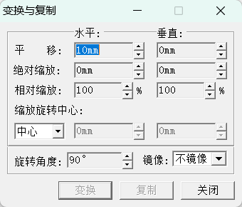

# GraphicsDemo

## 靠齐与分布

设定两个或两个以上焦点对象间的靠齐方式。

【横向靠齐】

- 横向向左靠齐  
- 横向向中靠齐
- 横向向右靠齐
- 横向左右靠齐
- 横向等比撑满
- 横向左边等距分布  
- 横向中线等距分布
- 横向右边等距分布  
- 横向等间距分布
- 横向指定线间距分布

【纵向靠齐】

- 纵向向上靠齐  
- 纵向向中靠齐
- 纵向向下靠齐  
- 纵向向撑齐
- 纵向等比撑齐
- 纵向上边线等距分布
- 纵向中线等距分布
- 纵向下边线等距分布
- 纵向等间距分布
- 纵向指定线间距分布

【页内靠齐】

- 横向页内居中
- 纵向页内居中

版面中的元素相对纸张中的排版范围靠齐。分为页内横向居中、页内纵向居中和页内居中三种。

注：**靠齐之前必须选择多个焦点对象，否则不能进行靠齐的操作**。

## 变换与复制

改变图形的位置、大小或对图形进行旋转。

- 【水平位移】
设定图形在水平方向上移动的距离。

- 【垂直位移】
设定图形在垂直方向上移动的距离。

- 【绝对缩放】
图形缩放的绝对量。

- 【相对缩放】
图形缩放的百分比。

- 【旋转中心】
设定图形旋转时的旋转中心。旋转中心可以设为图形外接矩形的左上、中上、右上、左中、中心、右中、左下、中下、右下等位置，也可以自定义旋转的中心。

- 【旋转角度】
设定图形旋转时的角度,角度可正可负。

- 【镜像】
分水平镜像与垂直镜像两种，分别使变换或复制对象呈现水平镜像与垂直镜像效果。

## 路径计算

对选定的多个图形对象进行并、交、减运算，生成新的图形。

- 【并集】对多个图形求并。

- 【交集】对多个图形求交。

- 【背景减前景】背景图形减去前景图形。

- 【前景减背景】前景图形减去背景图形。
